<div align="center">

```
╔══════════════════════════════════════════════════════════╗
║                                                          ║
║    > AYUSH ARYAN // CSE @ Vedam School of Technology    ║
║    > Building: AI Agents | Web Dev | DSA                ║
║    > Status: always_learning.exe                        ║
║                                                          ║
╚══════════════════════════════════════════════════════════╝
```

</div>

---

### `> whoami`

```bash
$ cat about.txt

Name       : Ayush Aryan
Role       : CSE Student (B.Tech)
Institute  : Vedam School of Technology
Location   : India
Focus      : AI Agents · Web Development · DSA in Java
Building   : Fordge Factory — AI Agent solutions
Goal       : Ship real AI products. ₹1L/month. 12 months.
```

---

### `> skills --list`

```
Languages   : Java · JavaScript · Python · HTML/CSS
Frameworks  : React · Node.js
AI/Agents   : OpenAI API · LangChain · n8n (learning)
Tools       : Git · VS Code · GitHub Actions
Currently   : Learning AI Agent building 🤖
```

---

### `> metrics --base`


---

### `> metrics --languages`


---

### `> metrics --calendar`



---

### `> metrics --habits`


---

### `> metrics --activity`


---

### `> metrics --leetcode`


---

### `> metrics --achievements`


---

### `> metrics --worldmap`


---

<div align="center">

```
// "The ego that devours the world begins with devouring yourself."
// — Blue Lock mindset 🔵🔒

[profile views: loading...] · [last updated: auto-daily]
```

</div>
