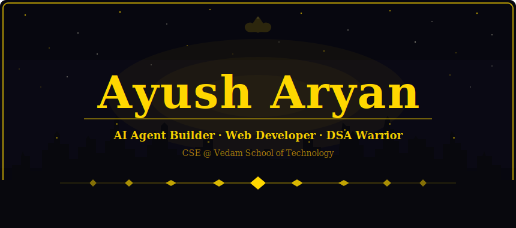

<div align="center">



</div>

---

<div align="center">

## ⚡ WHO AM I

<br>

> *「 Every great creation begins in darkness. 」*
> 
> *「 I transform raw ideas into living, breathing applications. 」*

<br>

<table>
<tr><td align="center" width="170"><b>🦇 NAME</b></td><td align="center" width="170"><b>⚙️ ROLE</b></td><td align="center" width="170"><b>📍 LOCATION</b></td></tr>
<tr><td align="center"><code>Ayush Aryan</code></td><td align="center"><code>AI Agent Builder</code></td><td align="center"><code>India</code></td></tr>
</table>

<table>
<tr><td align="center" width="255"><b>🏛️ INSTITUTE</b></td><td align="center" width="255"><b>🏭 CRAFT</b></td></tr>
<tr><td align="center"><code>Vedam School of Technology</code></td><td align="center"><code>Fordge Factory — AI Agents</code></td></tr>
</table>

<table>
<tr><td align="center" width="255"><b>⚔️ ARENA</b></td><td align="center" width="255"><b>🚀 SPIRIT</b></td></tr>
<tr><td align="center"><code>DSA in Java</code></td><td align="center"><code>Always Building, Always Shipping</code></td></tr>
</table>

</div>

---

<!-- ═══════════════════ WHAT I'M DOING RIGHT NOW ═══════════════════ -->

<div align="center">


<br><br>

I am currently building **AI-powered agents** at **Fordge Factory** and sharpening my **DSA skills in Java**.<br>
My exploration focuses on **autonomous agents, LLM orchestration, and full-stack development**.<br>
I am always open to exciting **open-source collaborations** and **AI agent projects**.<br>
Feel free to reach me at **[ayusharyan.dev@gmail.com](mailto:ayusharyan.dev@gmail.com)**.

</div>

<br>

---

<!-- ═══════════════════ THE TOOLKIT ═══════════════════ -->

<div align="center">


<br><br>

<table>
<tr>
<td align="center"><b>Frontend</b></td>
<td align="center"><b>Backend & AI</b></td>
</tr>
<tr>
<td align="center">

</td>
<td align="center">

</td>
</tr>
</table>

<table>
<tr>
<td align="center"><b>Tools, Deployment & Workflow</b></td>
<td align="center"><b>AI & LLM Stack</b></td>
</tr>
<tr>
<td align="center">

</td>
<td align="center">

&nbsp;


</td>
</tr>
</table>

</div>

<br>

---

<!-- ═══════════════════ CODING PROFILE ═══════════════════ -->

<div align="center">


<br><br>

[](https://leetcode.com/u/ayushharyan19/)
&nbsp;&nbsp;
[](https://codeforces.com/profile/ayushharyan19)

</div>

<br>

---

<!-- ═══════════════════ GITHUB STATS ═══════════════════ -->

<div align="center">


<br><br>


&nbsp;


<br><br>


</div>

<br>

---

<!-- ═══════════════════ ACTIVITY GRAPH ═══════════════════ -->

<div align="center">


</div>

<br>

---

<div align="center">

```text
// "The ego that devours the world begins with devouring yourself."
// — Blue Lock mindset 🔵🔒
```

<br>


</div>
