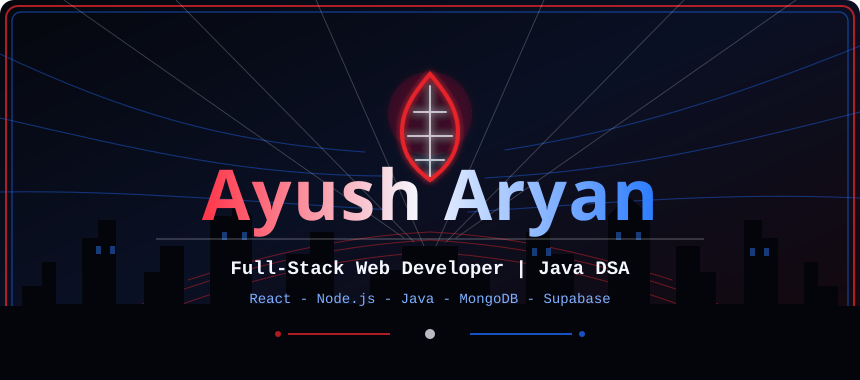

<div align="center">



</div>

---

<div align="center">

## 🕸️ WHO AM I

<br>

> *「 With great code comes great responsibility. 」*
> 
> *「 I build fast, clean, full-stack web experiences and sharpen my DSA every day. 」*

<br>

<table>
<tr><td align="center" width="170"><b>🕷️ NAME</b></td><td align="center" width="170"><b>⚙️ ROLE</b></td><td align="center" width="170"><b>📍 LOCATION</b></td></tr>
<tr><td align="center"><code>Ayush Aryan</code></td><td align="center"><code>Full-Stack Web Developer</code></td><td align="center"><code>India</code></td></tr>
</table>

<table>
<tr><td align="center" width="255"><b>🏛️ INSTITUTE</b></td><td align="center" width="255"><b>🧑‍💻 CRAFT</b></td></tr>
<tr><td align="center"><code>Vedam School of Technology</code></td><td align="center"><code>Frontend + Backend Web Apps</code></td></tr>
</table>

<table>
<tr><td align="center" width="255"><b>⚔️ ARENA</b></td><td align="center" width="255"><b>🚀 SPIRIT</b></td></tr>
<tr><td align="center"><code>DSA in Java</code></td><td align="center"><code>Build. Debug. Swing Again.</code></td></tr>
</table>

</div>

---

<!-- ═══════════════════ WHAT I'M DOING RIGHT NOW ═══════════════════ -->

<div align="center">


<br><br>

I am currently building **full-stack web projects** and sharpening my **DSA skills in Java**.<br>
My exploration focuses on **React, Node.js, databases, APIs, and clean user experiences**.<br>
I am always open to exciting **open-source collaborations** and **web development projects**.<br>
Feel free to reach me at **[ayush19062006@gmail.com](mailto:ayush19062006@gmail.com)**.

</div>

<br>

---

<!-- ═══════════════════ THE TOOLKIT ═══════════════════ -->

<div align="center">


<br><br>

<table>
<tr>
<td align="center"><b>Frontend</b></td>
<td align="center"><b>Backend & Databases</b></td>
</tr>
<tr>
<td align="center">

</td>
<td align="center">

</td>
</tr>
</table>

<table>
<tr>
<td align="center"><b>Tools, Deployment & Workflow</b></td>
<td align="center"><b>DSA & Core</b></td>
</tr>
<tr>
<td align="center">

</td>
<td align="center">

&nbsp;


</td>
</tr>
</table>

</div>

<br>

---

<!-- ═══════════════════ CODING PROFILE ═══════════════════ -->

<div align="center">


<br><br>

[](https://leetcode.com/u/ayushharyan19/)
&nbsp;&nbsp;
[](https://codeforces.com/profile/ayushharyan19)

</div>

<br>

---

<!-- ═══════════════════ GITHUB STATS ═══════════════════ -->

<div align="center">


<br><br>


&nbsp;


<br><br>


</div>

<br>

---

<!-- ═══════════════════ ACTIVITY GRAPH ═══════════════════ -->

<div align="center">


</div>

<br>

---

<!-- ═══════════════════ CONTRIBUTION SNAKE ═══════════════════ -->

<div align="center">

<picture>
  <source
    media="(prefers-color-scheme: dark)"
    srcset="https://raw.githubusercontent.com/ayushharyan19/ayushharyan19/output/github-snake-dark.svg" />
  <source
    media="(prefers-color-scheme: light)"
    srcset="https://raw.githubusercontent.com/ayushharyan19/ayushharyan19/output/github-snake.svg" />
  
</picture>

</div>

<br>

---

<div align="center">

```text
// Friendly neighborhood developer mode: ON.
// Java DSA by day. Full-stack builds by night.
```

<br>


</div>
